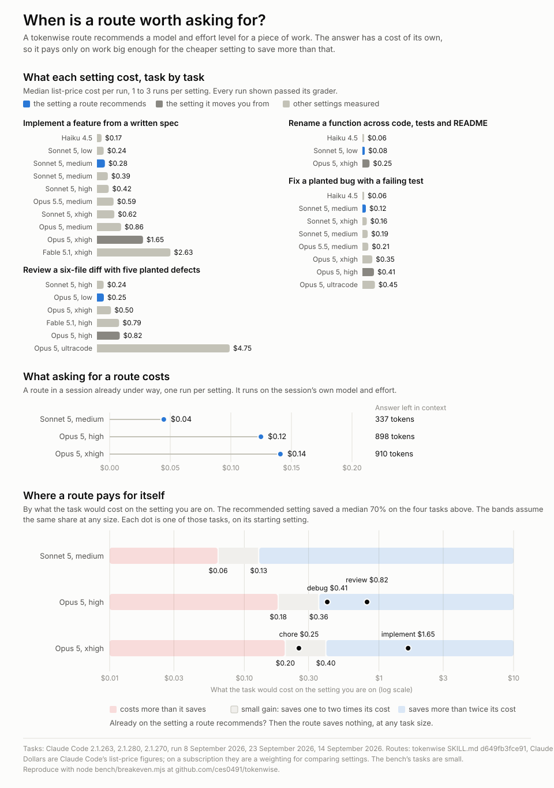

# tokenwise

A one-skill Claude Code plugin for choosing the model and effort level per phase of a session, and switching after `/clear` so the conversation is not re-processed.

## Why

Every API call re-sends the whole conversation. Across 137 sessions on one machine, input tokens outweighed output 428 to 1, and 99% of input was cached context re-read on every call. Of the ten sessions with the most calls, seven carried 396K to 535K tokens of context per call. Cost is context size times call count, plus output. The model sets the price per token, and effort changes how many tokens get spent, through thinking and extra turns.

Those are one machine's numbers, dated 11 September 2026. `node bench/context-profile.mjs` produces the same table from your own transcripts, so you can check the shape of it rather than take mine.

Two facts shape the advice. The prompt cache is per model, and on most models per effort level, so a `/model` or `/effort` change on a warm context re-processes all of it. And nothing can switch the running session's model for you: hooks can nudge or change the next session's settings, but the mid-session switch is your own `/model` and `/effort`.

## What it does

`/tokenwise:route <what you're about to do>` classifies the task on two axes (reading volume, judgment density) and answers with:

- the model and effort, as the exact `/model` and `/effort` commands, including when a task splits into enough independent parts to run under ultracode
- whether to `/clear` or `/compact` first, and what the switch costs if you don't
- what to push into subagents
- what you give up with the cheaper choice
- the signal that says move up a tier, using Anthropic's rule: didn't know enough means change model, didn't try hard enough means raise effort, or `ultrathink` for a single turn
- what "done" is for that phase, as one check you can run before trusting the cheaper setting

Claude also runs the skill when you ask which model or effort level to use. It runs in a forked subagent, so only its answer enters your conversation. `skills/route/reference.md` carries the measurements and sources.

## Does it work

Four of the routing table's nine rows were run against a small test project where a grader decides whether a run worked: hidden tests for implementing and debugging, with the original tests restored first so a model that edits tests to pass gets no credit; recall of five planted defects for reviewing; tests plus a grep for a rename. The table's last column says which rows those are, and marks the rest untested or not separated.

Across 63 graded runs, four of the nine claims in `bench/SCOPE.md` were falsified. Debugging and reviewing named a more expensive setting than the work needed. Forcing subagents onto Haiku saved 30%, short of the bench's 40% pass mark. And splitting a small task into a planning session and an implementation session cost more than doing it in one. Each row starts at the cheap end and names the failure that justifies moving up. Implementing a feature from a spec cost $0.17 on Haiku and $2.63 on Fable at xhigh, and both passed the same 37 tests. Reviewing a diff on Opus at low effort found all five planted defects in 3 turns; the same model at high effort found the same five in 13 turns for 3.3 times the cost. With ultracode on, Opus ran a workflow on that review and again found the same five, for 9.5 times the cost of Opus at xhigh.

Pass/fail thresholds were fixed before the results were read (`bench/SCOPE.md`) and the verdicts are computed from them. Full numbers in [docs/findings.md](docs/findings.md), method in [docs/methodology.md](docs/methodology.md), raw runs in `bench/results/`.

Those task costs leave out the skill itself, so its cost is measured separately. Loaded and unused, it adds 156 tokens of context. It runs on your session's model and effort: a route in a session already under way cost $0.04 asked from Sonnet 5 at medium, $0.10 from Opus 5 at high and $0.11 from Opus 5 at xhigh. The first route left 655 to 780 tokens behind, carried on every later call, and routing just before a `/clear` carries nothing. For a single small chore, asking can cost about what the cheaper model saves.



## Checking the figures

Every number above comes from a file in this repository or from a script in it. The first four checks are free and take seconds.

```sh
git clone https://github.com/ces0491/tokenwise && cd tokenwise

node bench/summarize.mjs --check     # do the published tables follow from the published runs?
node bench/skill-cost.mjs --compare 1.2.0,1.2.0-opus-high@1.2.0,1.2.0-sonnet-medium@1.2.0   # the skill's own cost, from the saved sessions
node bench/breakeven.mjs --check     # does the breakeven chart follow from the saved runs?
node bench/context-profile.mjs       # the token figures above, against your own transcripts
node bench/run.mjs --results bench/rerun   # re-run all 68 runs on your account, into a fresh directory
```

`--check` regenerates `bench/RESULTS.md` from `bench/results/runs.jsonl` and fails if the committed report differs, so you can confirm the tables were not edited by hand without spending anything. `context-profile.mjs` reads your own transcripts, so expect different numbers: the ratio and the cache share are the parts that should look familiar. Only the last command uses your account: the published runs come to $48.08 at list price. `node bench/summarize.mjs --results bench/rerun --out bench/rerun/RESULTS.md` then builds the report and verdicts from your runs, to set beside the published one.

What the bench cannot show: all 63 graded runs passed, so it measures cost at equal outcomes and never reaches the point where an expensive setting earns its price. The fixture is small, so it says nothing about long-context sessions. No run used `max` effort, and ultracode ran only on two small tasks, so whether it pays on large work that splits rests on Anthropic's docs and the skill's reading of them. And it measured the models the aliases pointed to on 8 and 14 September 2026: Haiku 4.5, Sonnet 5, Opus 5 and Fable 5.1. `node scripts/check-models.mjs --live` asks Claude Code what each alias points to today, for a small cost.

## Documentation

- [User guide](docs/guide.md) — day-to-day use, what to run where, and the two environment variables worth setting.
- [Findings](docs/findings.md) — what the bench measured, claim by claim, and the two verdicts that need a caveat.
- [Methodology](docs/methodology.md) — fixture, graders, run conditions, and what the harness cannot measure.
- [Document formats](experiments/doc-format/README.md) — what a PDF, an HTML page and their text conversions cost Claude Code to read.
- [Contributing](CONTRIBUTING.md) — the checks to run, how to change a routing row, and what adding a bench case involves.

## Install

From a local checkout:

```sh
claude --plugin-dir /path/to/tokenwise
```

From GitHub:

```text
/plugin marketplace add ces0491/tokenwise
/plugin install tokenwise@ces0491-plugins
```

Pair it with two environment variables so delegated reading runs on Haiku, including the built-in Explore and Plan subagents (Claude Code 2.1.257 or later):

```text
CLAUDE_CODE_SUBAGENT_MODEL=haiku
CLAUDE_CODE_SUBAGENT_MODEL_FORCE=1
```

With both set, the agents in a dynamic workflow run on Haiku too, so unset them before running ultracode on work that needs a stronger model.

## What it does not do

Measurement is covered elsewhere. `/usage` on subscription plans shows attribution by skill, subagent, plugin and MCP server and flags long context and cache misses. Anthropic's `session-report` plugin and ccusage report by session over time. For automated effort or model classification via hooks, see effort-router and claude-model-router-hook. The skill's reference file lists all of these.

## License

MIT.
